<div align="center">

# Enerbot Reference Matrix

Browse the 37 cultural references and memes behind the Enerbot Slack bot. Live regex playground and a clean JSON API, no auth required.

[![Live][badge-site]][url-site]
[![HTML5][badge-html]][url-html]
[![CSS3][badge-css]][url-css]
[![JavaScript][badge-js]][url-js]
[![Claude Code][badge-claude]][url-claude]
[![License][badge-license]](LICENSE)

[badge-site]:    https://img.shields.io/badge/live_site-0063e5?style=for-the-badge&logo=googlechrome&logoColor=white
[badge-html]:    https://img.shields.io/badge/HTML5-E34F26?style=for-the-badge&logo=html5&logoColor=white
[badge-css]:     https://img.shields.io/badge/CSS3-1572B6?style=for-the-badge&logo=css3&logoColor=white
[badge-js]:      https://img.shields.io/badge/JavaScript-F7DF1E?style=for-the-badge&logo=javascript&logoColor=black
[badge-claude]:  https://img.shields.io/badge/Claude_Code-CC785C?style=for-the-badge&logo=anthropic&logoColor=white
[badge-license]: https://img.shields.io/badge/license-MIT-404040?style=for-the-badge

[url-site]:   https://references.neorgon.com/
[url-html]:   #
[url-css]:    #
[url-js]:     #
[url-claude]: https://claude.ai/code

</div>

---

A static JSON API and live playground for every cultural reference and meme in the [Enerbot](https://github.com/energon-a-secas) Slack bot.

**Live:** [references.neorgon.com](https://references.neorgon.com/) · static HTML + JSON, no build step, no backend.

---

## What it does

The original bot identifies meme-worthy phrases by running incoming Slack messages through a table of regex patterns. Each match returns a video link or GIF. This repo exposes that entire reference table as a documented, versioned JSON API — and adds a browser playground where you can type anything and watch the patterns fire in real time.

---

## API endpoints

| Endpoint | Description |
|----------|-------------|
| `GET /api/v1/references.json` | All 37 cultural references with regex triggers, media URLs, language, and tags |
| `GET /api/v1/music.json` | Songs, dance videos, and music recommendations |

Both are plain JSON files served from GitHub Pages. No auth. No rate limits. CORS-open.

---

## Reference schema

```json
{
  "id":      "orden-66",
  "label":   "Orden 66",
  "source":  "Star Wars",
  "trigger": {
    "pattern":  "(orden 66)",
    "flags":    "i",
    "keywords": ["orden 66"]
  },
  "media": [
    { "url": "https://www.youtube.com/watch?v=PiRIZXvggqM", "type": "youtube", "primary": true }
  ],
  "language": "es",
  "tags": ["movie", "star-wars"]
}
```

### Fields

| Field | Type | Description |
|-------|------|-------------|
| `id` | string | Stable slug identifier |
| `label` | string | Human-readable reference name |
| `source` | string | Show, movie, or origin of the reference |
| `trigger.pattern` | string | Raw regex source — pass directly to `new RegExp(pattern, flags)` |
| `trigger.flags` | string | Regex flags (`"i"` = case-insensitive, `""` = none) |
| `trigger.keywords` | string[] | Readable list of phrases that trigger this entry |
| `media` | array | Media objects with `url`, `type` (`youtube`/`gif`), and `primary` flag |
| `language` | string | `"es"`, `"en"`, or `"es/en"` for bilingual triggers |
| `tags` | string[] | Source and content tags for filtering |
| `notes` | string? | Optional note about trigger quirks (e.g. case sensitivity) |

---

## Pattern matching

The trigger pattern is the exact Ruby regex source, translated to JavaScript. Reconstruct it anywhere:

**JavaScript**
```js
const res = await fetch('https://references.neorgon.com/api/v1/references.json');
const { references } = await res.json();

function match(text) {
  return references.filter(ref => {
    const re = new RegExp(ref.trigger.pattern, ref.trigger.flags);
    return re.test(text);
  });
}

match('ya es demasiado');
// → [{ id: "ya-es-demasiado", label: "No, esto ya es demasiado", source: "Te lo resumo así no más", … }]
```

**Python**
```python
import re, requests

data = requests.get("https://references.neorgon.com/api/v1/references.json").json()

def match(text):
    matches = []
    for ref in data["references"]:
        t = ref["trigger"]
        flags = re.IGNORECASE if "i" in t["flags"] else 0
        if re.search(t["pattern"], text, flags):
            matches.append(ref)
    return matches

match("madre de dios")
# → [{ "id": "madre-de-dios", … }]
```

**Ruby** (original bot pattern)
```ruby
ref = JSON.parse(File.read('api/v1/references.json'))
matches = ref['references'].select do |entry|
  flags = entry.dig('trigger', 'flags').include?('i') ? Regexp::IGNORECASE : 0
  Regexp.new(entry.dig('trigger', 'pattern'), flags) =~ text
end
```

---

## Sources

| Source | References | Language |
|--------|-----------|----------|
| Te lo resumo así no más | 21 | es |
| Los Simpsons | 4 | es |
| Family Guy | 3 | en |
| Star Wars | 2 | es |
| Carlos Matos (BitConnect) | 2 | en |
| Avengers: Infinity War | 1 | en |
| Harrison Ford / Air Force One | 1 | en |
| 31 Minutos | 1 | es |
| Gokudolls | 1 | es |
| No explain needed | 1 | es |

---

## Contributing a reference

Missing a reference? Submit one directly from the site or via GitHub:

1. Go to **[references.neorgon.com](https://references.neorgon.com/)** and click **Submit a reference**, or open a [new issue](https://github.com/energon-a-secas/reference-site/issues/new?template=new-reference.yml) using the form template.
2. Fill in the label, source, trigger phrases, media URL, language, and tags.
3. A maintainer reviews the submission. Once the `approved` label is added, a GitHub Action automatically opens a PR with the new entry.
4. After the PR is merged, the submitter is credited as a contributor.

No manual JSON editing required.

---

## Architecture



```
references-api/
├── index.html              # Playground + API docs
├── api/
│   └── v1/
│       ├── references.json # 37 cultural references with regex triggers
│       └── music.json      # Songs and recommendations
└── cb-enerbot-private/     # Source Ruby bot (reference only, own .git)
```

---

## Running locally

```bash
cd references-api
python3 -m http.server 8080
# open http://localhost:8080
```

Or open `index.html` directly in a browser.

---

## Design

- Deep space background (`#000912`)
- Animated starfield (180 stars, canvas)
- Per-source neon accent colors
- Live regex playground — input triggers real-time match highlighting across the entire card grid
- API docs with syntax-highlighted code examples
- `prefers-reduced-motion` respected

---

## Tech

Pure HTML + CSS + JavaScript. No frameworks, no build step. Data is a static JSON file — the "API" is just a well-structured file with a stable URL. Pattern matching uses the browser's native `RegExp`.

---

## Source data

Original patterns live in `cb-enerbot-private/actions/cultural_references.rb`.

---

<div align="center">
  <sub>Part of <a href="https://neorgon.com">Neorgon</a></sub>
</div>
